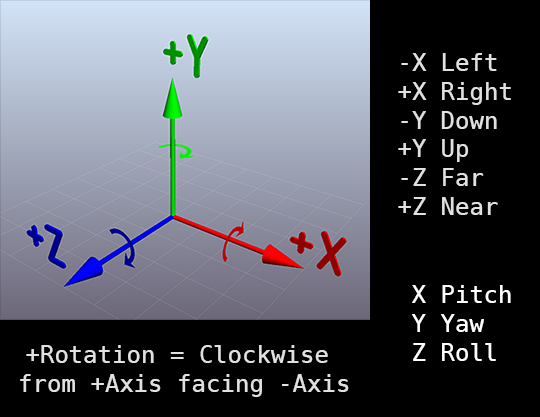

# AppGameKit-Framework-Libraries
A collection of various utility functions.

***This is all very much a work in progress.***

---

## A note about Vectors & Thetas:
Upon dealing with the incoherent mess of 3D vector spaces in ComputerGraphics, Mathmatics, Aviation, etc. 
And then learning that "there is no 'correct' vector space", they are arbitrary. 
This is the vector space that I've decided to use:

---

## Variable & Function Naming:
These rules are adhered to, unless I've overlooked something.

* Naming follows hierarchal ordering. That being: ThingAttribute. 
  Example: instead of "NewLength", "LengthNew" is used. 
  *Note: this is the opposite of typical English grammar.*

* Naming uses Capitals for the first letter of every word, lowercase for the rest. This includes acronyms.

* Underscores are typically avoided.
  Exceptions include:
  * Where the "thing" of ThingAttribute is a common thing 
  * Similarly, where there would typically be a dot ".", found in UserTypes. 
    Example: Pos.x -> Pos_X
    
* Single-letter & overly-truncated variable/function names are avoided, unless desired for compact code.

---

## Common Abbreviations:
These are often used because compact code is preferred.

    Pos = "Position"
    Rot = "Rotation"
    Siz = "Size"
    Scl = "Scale"
    Nrm = "Normal"
    Rds = "Radius"
    Dir = "Direction" or "Directory"
    Clr = "Color"

    Dlt = "Delta"

    Deg = "Degrees"
    Rad = "Radian"

    Pnt = "Point"
    Lin = "Line"
    Ray = "Ray"

    Cir = "Circle"
    Tri = "Triangle"
    Rct = "Rectangle"

    Sph = "Sphere"
    Box = "Right-Angled-Quadrilateral-Hexahedron" :P

    Inv = "Invert"
    Cmp = "Complement"
    Rcp = "Reciprocal"

